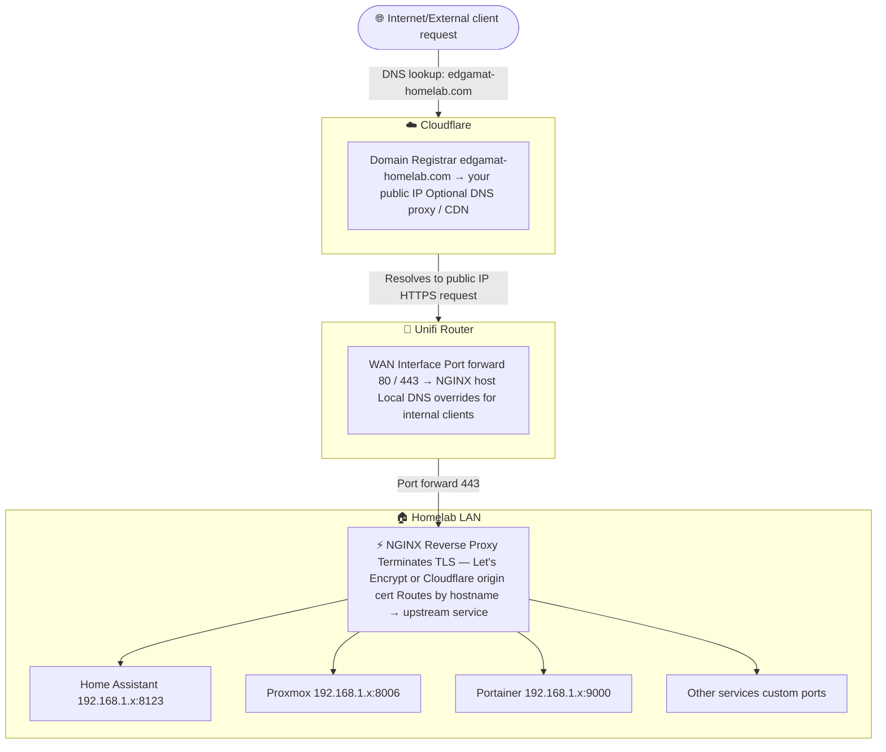

One of the first things I set up in my Homelab is a reverse proxy.

<!--more-->

## What is a Reverse Proxy

As I spin up containers and virtual machines in my homelab, I want to be able to use domain names
rather than IP addresses (and port numbers) to access them.

**Bad** 192.168.10.126:8006
**Good** proxmox.edgamat-homelab.com

A reverse proxy helps me achieve this. It is a service that sits between me and my homelab devices.
when I make a request to the reverse proxy (e.g. <https://proxmox.edgamat-homelab.com>), it routes
the traffic to port 8006 at IP address 192.168.10.126.



## NGINX Proxy Manager (NPM)

NGINX is honestly the only reverse proxy I know. There are others out there, but I'll stick with what
I know. I discovered NGINX Proxy Manager (NPM) which is a nice web-based GUI for managing the configuration
of NGINX. As a bonus it integrates with Let's Encrypt to set up free SSL/TLS certificates. With a
registered domain name, this eliminates those SSL/TLS warning messages in browsers. Yay!

## Hosting NPM in Docker

I decided to host NPM in a container using Docker. I am using a Raspberry Pi to host some light-weight
services, so that's where I am placing NPM. I am using the following Docker Compose file:

```yml
services:
  npm:
    container_name: npm
    image: jc21/nginx-proxy-manager:latest
    restart: always
    volumes:
      - /srv/docker/npm/data:/data
      - /srv/docker/npm/letsencrypt:/etc/letsencrypt
    ports:
      - 80:80
      - 443:443
      - 81:81  # Admin UI

networks:
  default:
    name: npm_network
```

I set up the local bind mounts using the following commands:

```bash
sudo mkdir /srv/docker
sudo chown $USER:docker /srv/docker
sudo chmod 770 /srv/docker
sudo chmod g+s /srv/docker
mkdir -p /srv/docker/npm/data /srv/docker/npm/letsencrypt
```

I then started the container:

```bash
docker compose up -d
```

With all this setup in place, I was ready to give things a try. I went to the NPM admin page:

http://192.168.10.125:81/

I created an account and everything was working!

## Registering a Domain

I use GoDaddy to register the domain for my blog, but for my homelab I wanted to try something different.
I chose Cloudflare, simply by reputation (and seemingly good support with NPM). I registered my homelab
domain by creating an account and choosing a domain name: `edgamat-homelab.com`. I was able to register
the domain for a reasonable cost but if it had been much more expensive I would have looked for
another option.

## Adding a Certificate

In NPM, I added the certificate using the "Let's Encrypt via DNS" option:

```text
Domain Names: *.edgamat-homelab.com
Key Type: ECDSA 256 (the default)
DNS Provider: Cloudflare
```

When I selected Cloudflare, I had to provide an API token:

```text
# Cloudflare API token
dns_cloudflare_api_token=0123456789abcdef0123456789abcdef01234567
```

I was able to create a token within my Profile on the Cloudflare website. I selected the "Edit zone DNS"
template from the list. Under "Zone Resources", I selected my domain. I created the token and
used it when creating the certificate in NPM.

## Adding DNS Entries

In my router, I created a DNS rule for my first proxy host, NPM itself!

```text
npm.edgamat-homelab.com =>  192.168.10.125
```

**NOTE** Originally I was using a single wildcard entry (*.edgamat-homelab.com). But I have moved
to using separate entries for each service.

## Adding Proxy Hosts

In NPM, I created a new proxy host for NPM:

```text
Domain Names: npm.edgamat-homelab.com
Scheme: http
Forward Hostname / IP: 192.168.10.125
Port: 81
```

Under the SSL tab, I selected my certificate and enabled "Force SSL" and "Enable HTTP/2 Support".

## The Result

I gave the new proxy host a try:

<https://npm.edgamat-homelab.com>

I was successfully able to access NPM. I felt relieved that it all worked. I have also added 2 additional
hosts for Portainer and Proxmox. With the Proxmox proxy, I also had to enable "Websockets Support" but
otherwise it used the same setup as the others.

It has been great having a proxy server running right for the start of my homelab adventure. It
is not a necessary service to have, but makes things so much easier.
